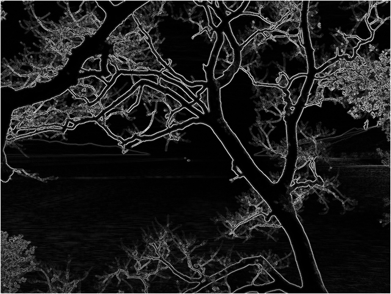
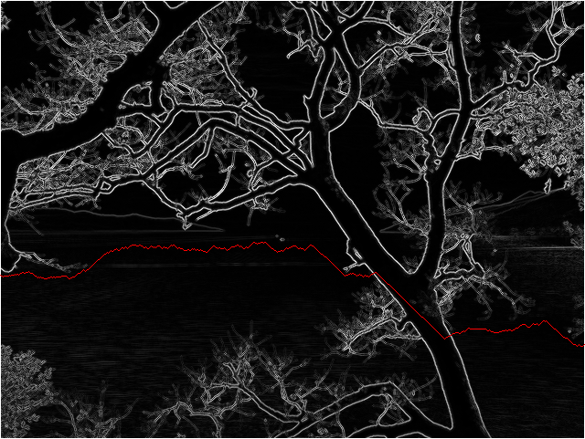
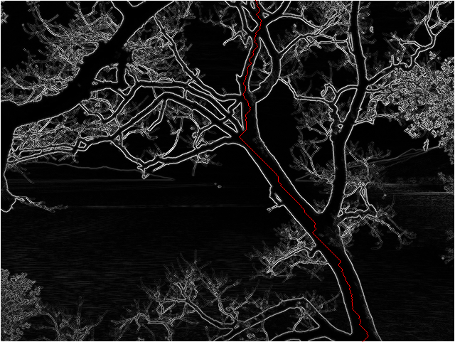

[Princeton Algorithms II Week 2: Seam Carving](https://www.coursera.org/learn/algorithms-part2/home/week/2)

### Image samples processed by application
#### Original image (taken by myself)

#### Energy values

#### Horizontal seam

#### Vertical seam

#### Horizontal scaling
